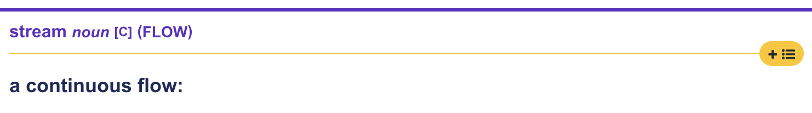
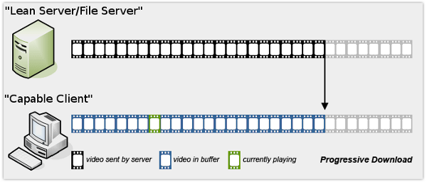
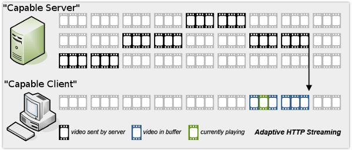
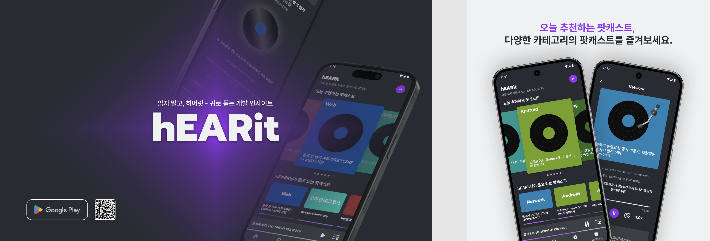

# 스트리밍 `Progressive Download` Vs `adaptive http streaming`
## 서론

IT 팟캐스트 서비스인 ‘히어릿’에서 백엔드를 개발하게 되었습니다.

스트리밍의 원리와, 미디어 서비스를 개발할 때 어떤 방식을 선택하면 좋을지 함께 알아보겠습니다.

추가로 저희 서비스에서는 어떤 방식을 선택했는지 공유하고자 합니다.

## 본론

### **스트리밍이란 무엇일까요?**

출처 :https://dictionary.cambridge.org/dictionary/english/stream

Stream의 뜻은 끊임없이 흐른다는 뜻입니다.

요즘은 ott로 영화를 선택만 하면 바로 재생할 수 있습니다. 출근 길에 뮤직 플레이어로 음악을 고르면 바로 음악이 흘러나옵니다. 이러한 편리함은 스트리밍으로 끊임없이 데이터가 흐르기 때문에 가능한 것 입니다.

만약 스트리밍 대신 다운로드를 했다면 어땠을까요?  영화를 선택했더라도 최소 몇분, 네트워크 환경이 안 좋다면 몇시간을 기다려야할것입니다. 시간 뿐만 아니라, 영화 한 편 만큼의 하드디스크 용량 또한 준비해 놓아야합니다.

예시로 케이팝 데몬 헌터스를 봐 볼까요? 케이팝 데몬 헌터스는 1시간 36분이며 1080p 화질로 본다고 가정하겠습니다.

|  | **다운로드** | **스트리밍** |
| --- | --- | --- |
| **필요한 용량** | 웹에서 스트리밍되는 영상과 비슷한 수준 기준 약 4GB  | 없음. |
| **보기까지 필요한 준비 시간** | 한국 가정에서 보편적으로 사용하는 100Mps 기준 약 5분 28초 | 거의 즉시( 몇 초 이내) |
| **장점** | 인터넷 없이도 재생이 가능. 끊김이 없음 | 초기에 기다릴 필요가 없음 |
| **단점** | 저장 공간을 차지, 기다려야함 | 인터넷 연결이 계속 필요, 버퍼링 |

### **어떤 경우에 스트리밍을 도입해야할까요?**

스트리밍의 큰 장점은 기다릴 필요 없이 컨텐츠를 소비할 수 있다는 것 입니다. 만약 여러분의 서비스의 목표가 다양한 콘텐츠 소비와 이로 사용자의 체류 시간을 늘리고자 한다면 스트리밍이 좋은 선택이 될 수 있습니다.

예를 들어, 팟캐스트 서비스는 스트리밍에 매우 적절한 도메인 입니다. 사용자는 부담없이 여러 팟캐스트를 짧게 짧게 들어보면서 맘에 드는 컨텐츠를 발견할 수 있습니다.

또, 중간에 동적으로 다른 컨텐츠를 삽입해야하는 경우에도 좋은 선택이 될 수 있습니다.

예를 들어, 영상 시작이나 중간에 광고를 넣어서 수익을 창출 할 수 있습니다. 만약 다운로드했다면 절대로 불가능한 일이었을 겁니다.

### **스트리밍은 어떻게 구현할 수 있을까요?**

스트리밍은 결국 큰 용량의 파일을 여러 개의 파일로 쪼개서 실시간으로 보내는 것 입니다.

이론적으로 2가지 방법을 살펴보겠습니다.

#### 1. Progressive Download

   

   점진적 다운로드라는 뜻에서 볼 수 있듯이 HTTP Protocol을 통해 미디어 파일을 처음부터 순서대로 다운로드하면서, 버퍼에 데이터가 충분히 쌓이면 재생을 시작하는 방식입니다. 사실상 스트리밍보다는 다운로드에 더 가까운 기술입니다.

   만약 네트워크가 지속적으로 좋지 않다면, 사용자는 계속 기다려야만 하는 상황이 발생할 수 있습니다. 이러한 문제를 해결하기 위해 Adaptive HTTP Streaming이 나왔습니다.

#### 2. Adaptive HTTP Streaming

   

   적응형 HTTP Streaming의 목표는 사용자의 네트워크 환경에 반응하여 최소한의 버퍼링으로 끊임없이 스트리밍을 제공하는 것입니다.

   이를 위해 서버는 하나의 미디어를 다양한 화질로 인코딩한 작은 조각 chunk로 나눕니다. 플레이어는 사용자의 네트워크 상태에 맞춰 최적의 chunk를 실시간으로 요청합니다.

---
> 여기서부터 보완 필요

### 개발자니까 이론 대신 코드로 들어가볼까요?

두가지 방식을 모두 스프링으로 간단하게 구현해보겠습니다.

( 앞으로 설명은 mp3기준으로 하겠습니다. )

> progressvie는 다운로드 받은 걸 어디에 저장해야하지..

<실제 코드 & 예시 사이트 추가 예정>

#### 1. progressive download
### 2. adaptive http streaming

### 실제로는 서버 대신 클라우드 서비스를 사용합니다.

만약 서버가 스트리밍을 해야한다면, 스트리밍은 지속적으로 네트워크 통신을 하기 때문에 서버의 부하가 너무 커집니다. 서버가 모든 미디어를 저장한다면 저장해야하는 양이 너무 많아지며, 만약 S3같은 외부 클라우드 저장소에 저장했다면 이제 서버가 스트리밍 하기 위해선 플레이어 → 서버 → S3 → 서버 → 플레이어로 추가적인 대역폭이 필요합니다.

클라우드 (ex CloudFront+ S3) 서비스가 스트리밍을 한다면, 백엔드 서버를 거치지 않고 플레이어 → 클라우드 로 요청을 보내기 때문에 빠르고, 동시에 서버에 부하가 가지 않습니다. 데이터 전송 비용도 절약할 수 있습니다. 또, CDN을 사용한다면 사용자에게 더욱 빠르게 스트리밍을 제공할 수 있습니다.

그렇다면 클라우드 서비스로도 두가지 스트리밍을 구현해보겠습니다.

<실제 적용 방법 추가 예정>

### 1. progressive download (presigned url)
### 2. adaptive http streaming

이렇게 직접 구현, 클라우드 서비스로 구현을 해보면서 알 수 있는 점은

progressive download는

- 클라이언트와 서버 양 쪽 구현이 매우 간단합니다.
- 또다른 점들 ..

adaptive http streaming은

- 서버 측에서 저장해야하는 양이 대략 n% 증가합니다.
- 서버와 클라이언트 측 모두 구현이 progressive 방식에 비해 복잡합니다.

### **우리 서비스에서는 어떻게 할까?**

구현 방식은 어렵더라도, adaptive http streaming을 사용하는 것이 사용자에게 더 편리함을 주는 것이 아닐까? 라고 생각할 수 있습니다.

하지만 자신의 서비스 도메인의 특징을 이해하고, 가장 효율적인 동시에 사용자에게 편리함을 줄 수 있는 방법을 선택해야 합니다.

#### **참여하고 있는 프로젝트**

히어릿은 IT 팟캐스트 앱으로, 가볍게 CS/IT트렌드/프레임워크 등등 정보를 팟캐스트로 들을 수 있습니다.

원하는 팟캐스트를 편하게 찾을 수 있도록 추천 숏폼도 제공합니다.

> PlayStore : https://play.google.com/store/apps/details?id=com.onair.hearit

히어릿 서비스의 미디어 특성은

- 약 7분 ~ 30분 길이의 단일 .mp3 파일
- 하나의 팟캐스트가 하나의 mp3로 완결
- 사용자는 재생 중간 이동 외엔 별다른 상호작용이 없음
- 중간 광고를 넣을 계획이 없음

입니다.

이런 오디오 미디어는 비트레이트가 128kbps로 대역폭의 요구가 낮습니다. 즉 사용자의 네트워크 환경에 영향이 크지 않습니다. 동시에 품질 전환의 기능이 무의미할 정도로 음질의 차이가 크지 않고 사용자 또한 팟캐스트의 음질보단 정보 습득의 목적이 더 큽니다.

<실제 음질 차이를 들어볼 수 있게 한다>

따라서 팟캐스트 청취 목적에 음질보다 정보 습득이라는 점, 인코딩 및 manifest 관리 비용이 추가되는 것에 비해 오디오 미디어의 음질 차이가 크지 않은 점, 추가적으로  빠르게 개발하고 변화가 많은 서비스 개발 초기 단계라는 점을 고려해 저희는 플레이어와 서버의 구현 난이도가 낮은 클라우드 서비스인 S3를 이용한 progressive 방식을 채택하였습니다.

< progressive 작동 그림 >

### progressive를 채택하고 한 달간 실제로 서비스를 운영하면서 느낀 점은 ..

<추가 예정으로 평균 로딩 시간, 버퍼링 발생률, S3 비용, 사용자가 바를 이동했을 때 어떻게 되는지 등>

- Range 요청 단위 조정

저희는 현재 필요함을 느끼지 못해서 진행하지 않았으나, 추후에 CDN으로 캐시 최적화를 진행하면 좋을 것 같습니다.

## 마무리

추가적으로 생각해보면 좋을 점들을 남기며 글을 마무리합니다.

- CDN 캐시 정책 설계
- 외부 저장소에 의존하는 점