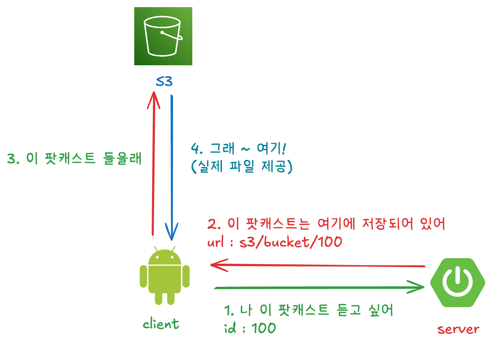
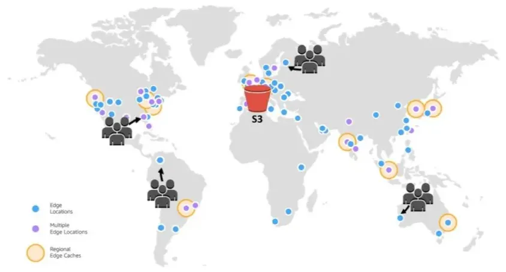

# 스트리밍 어떻게 했나요? (그냥 되던데요..)


## 서론

IT 팟캐스트 서비스인 ‘히어릿’에서 백엔드를 개발하게 되었습니다.

런칭 페스티벌을 진행하면서 가장 많이 받았던 질문은

> 스트리밍 어떻게 했어요?

였습니다.

정말 솔직하게 대답하자면 저희가 한 일은 없었습니다.

라이브러리들이 다 해주었기 때문입니다. aka 그냥 되던데요..?

하지만 그때 떠오르는 구구 코치의 말씀 .. 

> 그냥 되는 건 없다.

팟캐스트 앱의 핵심인 스트리밍이 어떻게 되고 있는지 제대로 알아보고 개선할 지점이 없는지, 혹시나 문제가 발생할 부분은 없는지 파악해봐야겠다는 생각이 들었습니다.

한번 같이 스트리밍이 어떻게 **그냥** 되었는지 살펴봅시다.

## 프로젝트 소개

그 전에 저희 프로젝트가 어떤 프로젝트인지 가볍게 소개하고 넘어가면 좋을 것 같습니다.


히어릿은 IT 팟캐스트 앱으로, 가볍게 CS/IT트렌드/프레임워크 등등 정보를 팟캐스트로 들을 수 있습니다.

원하는 팟캐스트를 편하게 찾을 수 있도록 추천 숏폼도 제공합니다.

> PlayStore : https://play.google.com/store/apps/details?id=com.onair.hearit

## 현재 시스템 구조

현재 저희 시스템 구조를 살펴보겠습니다.



이렇게 서비스가 돌아가고 있습니다.
구체적인 기술들을 언급하고 들어가자면 저희는 현재 스프링 부트 서버를 사용하고 있으며, 안드로이드에서는 팟캐스트를 재생하기 위해 Media3라는 것을 사용하고 있습니다.
미디어 파일들을 실제로 저장하고 있는 것은 s3입니다.

1. 가장 먼저 클라이언트가 어떤 팟캐스트를 듣고 싶다고 서버에 요청을 보냅니다.
2. 서버가 이 팟캐스트의 파일 .mp3가 실제로 어디에 저장되어있는지 url을 보내줍니다. 저희는 s3에 저장해놨기 때문에 s3의 주소를 보내줄 것 입니다.
3. 클라이언트가 이 url로 요청을 보냅니다. 
4. s3에서 이 요청을 받아서 해당 파일을 반환해줍니다.

이런 구조로만 본다면 파일을 다운로드 받아서 듣고 있는건가? 라고 생각할 수 있습니다.
저희도 처음에 그렇게 생각했습니다.

하지만 막상 히어릿을 깔아서 재생해본다면 이리저리 재생바를 이동시켜도 끊김없이 바로바로 재생되는 것을 확인하실 수 있을 겁니다.

어떻게 된 걸까요?

## 바로 Progressive Download라는 기술과 HTTP의 Range 때문입니다.

먼저 Progressive Download에 대해서 알아봅시다.

### Progressive Download


점진적 다운로드라는 뜻에서 볼 수 있듯이 HTTP Protocol을 통해 미디어 파일을 처음부터 순서대로 다운로드하면서, 버퍼에 데이터가 충분히 쌓이면 재생을 시작하는 방식입니다. 사실상 스트리밍보다는 다운로드에 더 가까운 기술입니다.

만약 네트워크가 지속적으로 좋지 않다면, 사용자는 계속 기다려야만 하는 상황이 발생할 수 있습니다. 이러한 문제를 해결하기 위해 Adaptive HTTP Streaming이 나왔습니다.

기왕 알아가는 김에 Adaptive streaming까지 설명을 해보자면..

### Adaptive HTTP Streaming


적응형 HTTP Streaming의 목표는 사용자의 네트워크 환경에 반응하여 최소한의 버퍼링으로 끊임없이 스트리밍을 제공하는 것입니다.

이를 위해 서버는 하나의 미디어를 다양한 화질로 인코딩한 작은 조각 chunk로 나눕니다. 플레이어는 사용자의 네트워크 상태에 맞춰 최적의 chunk를 실시간으로 요청합니다.

그렇습니다.
그럼 Progressive Download라는 걸 사용하고 있으면 결국은 스트리밍이 아니라 다운로드 인거 아닐까요

하지만 이때 http range를 사용합니다.

### HTTP Range

Range 요청이란 클라이언트가 "파일 전체 말고, 0바이트부터 100만 바이트까지만 줘" 또는 "5억 바이트 지점부터 끝까지만 줘"처럼 파일의 특정 부분만 콕 집어 요청하는 기능입니다.

이러한 Range 요청이 가능한 이유는 S3가 파일 창고를 넘어서, 그 파일을 https로 제공해주는 웹서버 역할까지 해주기 때문입니다.

그래서 https://s3/bucket/나팟캐스트줘 에다가 range header를 붙혀서 일부분만 요청을 보낼 수 있습니다.

그렇다면 이제 클라이언트 측에서 구체적으로 어떻게 동작하는지 살펴볼까요?

### 클라이언트 : Media3의 역할

앞으로 Client는 Media3로 부르겠습니다.

1. 재생 시작 (버퍼링): Media3는 먼저 파일 전체를 다운로드하지 않습니다. 대신 HTTP Range 요청을 사용해 파일의 맨 앞부분(예: Range: bytes=0-1000000) 만 S3에 요청합니다.

2. 다운로드와 동시 재생: S3가 보내준 '앞부분' 데이터가 버퍼에 충분히 차는 즉시 (예: 2~3초 분량), Media3는 재생을 시작합니다.

3. 지속적인 다운로드: 재생이 되는 동안에도 Media3는 백그라운드에서 파일의 뒷부분을 계속 이어서 (Range: bytes=1000001-...) 다운로드하고 버퍼에 채워 넣습니다.

이런 식으로 팟캐스트가 재생 되기 때문에 사용자는 '스트리밍'처럼 느끼게 됩니다.

이때, Media3가 지속적으로 뒷부분을 순차적으로 다운받고 있는데 어떻게 재생바를 이리저리 이동시켜도(탐색) 바로 바로 들을 수 있는 걸까요?

### 탐색이 가능한 이유

이것은 HTTP의 Range 때문입니다.

사용자가 재생 바를 중간 지점(예: 10분)으로 확 당겼을 때를 가정해볼까요?

1. 탐색 이벤트 발생: 사용자가 10분 지점을 클릭합니다.

2. Media3의 계산: Media3는 "10분 지점은 이 MP4 파일의 약 500MB 바이트(byte) 위치쯤이군" 하고 계산합니다.

3. 새로운 Range 요청: Media3는 기존 다운로드를 즉시 중단하고, S3에 새로운 요청을 보냅니다.

```http request
GET /my-video.mp4 HTTP/1.1

Range: bytes=500000000- (500MB 지점부터 끝까지 줘!)
```

4. S3의 응답: S3는 206 Partial Content (파일의 일부분만 보낸다)라는 응답과 함께, 정확히 500MB 지점부터 데이터를 보내주기 시작합니다.

5. 재생 재개: Media3는 그 지점부터 버퍼를 다시 채우고 거의 즉시 10분 지점부터 재생을 재개합니다.

정말 신기하죠?

## 요약

S3 서버: 파일 줄게. 네가 원하는 부분만 잘라서도 줄 수 있어. (Range 지원)

Media3: 파일 다 필요 없고, 일단 앞부분만 줘. 재생하면서 뒤에 거 받을게. 어, 사용자가 중간 눌렀네? 그럼 거기부터 다시 줘! (Range 요청)

이때 또 한가지 궁금증이 생길 수 있습니다.
어쨋든 다운로드를 하는 형식인데 현재 저희 서비스가 Adaptvie Streaming처럼 지연이 거의 없는 이유는 무엇일까요?

## 어떻게 이렇게 빠를 수 있는가?

히어릿 서비스의 미디어 특성으로 이유를 알 수 있습니다,

- 약 7분 ~ 30분 길이의 단일 .mp3 파일
- 하나의 팟캐스트가 하나의 mp3로 완결
- 사용자는 재생 중간 이동 외엔 별다른 상호작용이 없음

결국, MP3 파일 자체가 비디오 같은 미디어에 비해 압도적으로 가볍기 때문입니다.

mp3는 고음질인 경우에도 0.32 Mbps로 대역폭의 요구가 낮습니다. 즉 사용자의 네트워크 환경에 영향이 크지 않습니다.
요즘 일반적인 Wi-Fi 속도인 500 Mbps는 가장 높은 음질의 MP3(0.32 Mbps)보다 1,500배 이상 빠릅니다.

표로 비교해볼까요?

| 항목                         | 실효 처리량(Mbps) | MP3 320 kbps 동시 스트림 수(이론) | MP3 50초 선버퍼 시간 | 
|----------------------------|--------------------|----------------------------------|----------------------|
| Wifi 500 Mbps (실효 70% 350) | 350 | 1,094 | 0.05초 |
| Wifi 1 Gbps (실효 70% 700)   | 700 | 2,188 | 0.02초 |

## 그럼 Adaptvie Streaming은 적용 안 할건까요?

네!

저희는 팟캐스트 청취 목적에 음질보다 정보 습득이라는 점, 
인코딩 및 manifest 관리 비용이 추가되는 것에 비해 오디오 미디어의 음질 차이가 크지 않은 점, 
추가적으로  빠르게 개발하고 변화가 많은 서비스 개발 초기 단계라는 점을 고려해 
저희는 플레이어와 서버의 구현 난이도가 낮은 클라우드 서비스인 S3를 이용한 progressive 방식을 유지합니다.

## 개선 여지

### CDN 도입


현재 구조는 전세계의 요청이 서울 리전의 s3에 요청으로 꽂히게 됩니다. 

사용자 수가 증가하면 현재 S3가 위치한 아시아 태평양(서울) 리전에서 먼 지역의 사용자가 많아지게 된다. 이는 네트워크 지연이 커져 스트리밍이 느려지는 문제가 발생할 수 있습니다.



이 문제를 해결하기 위해 **CDN**을 도입할 수 있습니다. CDN(Content Delivery Network)은 전 세계에 분산된 서버에 콘텐츠를 캐싱해, 사용자에게 가장 가까운 위치에서 빠르고 안정적으로 데이터를 전달하는 네트워크입니다.

### adaptive streaming 
현재에는 도무지 도입할 필요가 없을 것 같은데 만약 중간에 광고를 넣고 싶다거나, 고음질의 팟캐스트를 제공하고 싶다면 사용해볼 수 도 있을 것 같습니다.

### caching
현재 안드로이드에서는 버퍼에 쌓였다가 재생이 끝나면 즉시 버리는 설정인데, 중간에 네트워크가 끊기더라도 이전에 들었던 내용은 다시 듣고 싶은 니즈가 파악이 된다면
사본을 캐싱에 저장을 하는 기능을 도입할 수도 있을 것 같습니다.

### 장애 대응
최근에 AWS의 us-east 리전이 장애가 발생한적이 있습니다.
만약 저희 서비스의 s3 리전에도 그런 발생한다면? 저희 서비스는 정말 할 수 있는게 없이 서비스가 먹통이 될 것 입니다.

하나의 해결책으로 S3의 리전 간 복제(Cross-Region Replication)를 설정하여 중요한 팟캐스트 MP3 파일들을 다른 리전의 백업 버킷에 자동으로 복제해둘 수 있습니다.

그런 다음, Amazon CloudFront의 '오리진 장애 조치(Origin Failover)' 기능을 사용하여 기본 S3 리전에 장애가 발생하면 즉시 백업 리전의 버킷에서 파일을 가져오도록 자동 전환 설정을 하면 
한 리전이 완전히 마비되더라도 사용자는 중단 없이 팟캐스트를 들을 수 있다고 합니다.

## 마무리

읽어주셔서 감사합니다.

기술을 사용할 때 그냥 되는 건 없다는 걸 다시 한번 배웠습니다.

그리고 생각보다 지금 문제가 없다는 의외의 사실도 알 수 있었습니다.

하지만 뭐든 알고 쓰는 것과 모르고 사용하는 건 하늘과 땅 차이라고 생각합니다. 

다들 원리를 알고 서비스를 위한 최선을 선택을 하는 개발자가 되길 바랍니다.

감사합니다.
